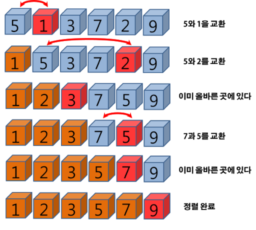

# 04-2 선택 정렬

대상 데이터에서 최대나 최소 데이터를 데이터가 나열된 순으로 찾아가며 선택하는 방법이다.
- 구현 방법 복잡
- 시간 복잡도 O(n^2)으로 효율적이지 않음
- 그래서 코딩테스트에서 많이 사용하진 않음

## 선택 정렬의 핵심 이론
최솟값 **또는** 최댓값을 찾고, 남은 정렬 부분의 가장 앞에 있는 데이터와 swap하는 것이 핵심이다.
- 내림차순: 최솟값
- 오름차순: 최댓값

## 선택 정렬 과정
1. 남은 정렬 부분에서 최솟값 또는 최댓값을 찾는다.
2. 남은 정렬 부분에서 가장 앞에 있는 데이터와 선택된 데이터를 swap한다.
3. 가장 앞에 있는 데이터의 위치를 변경해(`index`++) 남은 정렬 부분의 범위를 축소한다.
4. 전체 데이터 크기만큼 `index`가 커질 때까지, 즉 남은 정렬 부분이 없을 때까지 반복한다.

선택 정렬 자체를 묻는 코딩 테스트 문제는 잘 나오지 않지만, 이 원리를 응용하는 문제는 나올 수 있으므로 어떤 원리인지만 알아두자.

